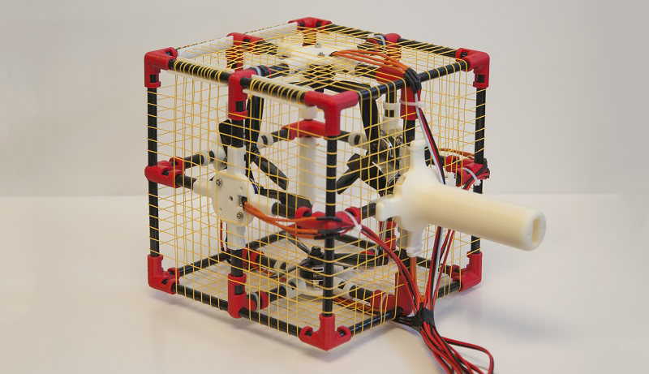

# Thor's Hammer

## What is Thor's Hammer?

Thor's Hammer is an ungrounded force feedback device that uses propeller propulsion to create 3-DOF force feedback. The device can create 4 N of force in three dimensions and it can be used to make the VR/AR interaction more immersive. You can find the paper to be published at ACM CHI 2018 [here](http://seongkookheo.com/thorshammer.pdf).



## What are in this repository?

The purpose of this repository is to share materials needed to build Thor's Hammer so that people who are interested in building one (you) can build their own hammer. 

This repository has

* **3D Models** of parts to be 3D-printed, including joints, mounts, and handle. 

  * **EdgeJoint.stl** Joints on the edges to connect three 8 mm-diameter carbon fiber tubes. Print 8.
  * **MiddleJoint.stl** Joints that goes in the middle of a 8 mm-diameter carbon fiber tube that connect two 10 mm-diameter carbon fiber tubes. Print 12.
  * **MotorMount.stl** This part holds a motor and connects four 10 mm-diameter carbon fiber tubes. Print 6. There is a hole for motor wires to come out of the hammer. 
  * **MeshHolder.stl** This part helps the badminton strings to be uniformly apart from other strings. Print 12 / 24. 
  * **Handle.stl** This is a part that allows you to hold the device in hand. Print one using dense infill ratio for strength (>30%, may differ by printers). 

* **Firmware** code for Arduino to control Electronic Speed Controllers (ESCs).

  * **Thor.ino** Firmware file for Aruidno Leonardo board. 

* **Schematic** showing the electric connections between parts.

* **Software** code to test the Hammer and to connect it with Unity. 

  * **Unity** Includes "ForceSend.cs", a Unity script to send force information to the ThorController software via UDP port 8888.

    Add the file in your Unity project and use like the following:

    ```cs
    ForceSend force;
    Vector3 forceVector = new Vector3(0, 1.0f, 0);
    force.SendForce(this.transform.rotation, forceVector);	// First parameter is the device rotation in quaternion.
    ```

  * **ThorController** A program that connects to the Arduino connected to ESCs. This program listens to packets on UDP port 8888 and delivers the force vector coming from Unity to Arduino. This program also allows testing force vectors in 3DOF. This program should be connected to the Arduino board and running to get your Unity software generate force feedback. 

## What else do I need to build it?

There are other parts you need to build the device. The followings are the parts we used for our prototype, but most parts can be substituted with other parts with similar sizes / specs. You will also need M3 screws to attach the motors on the motor mount.  

#### Motors

* 6 x Brushless motors (we used 2600KV T-Motor F40 III, https://www.amazon.com/T-Motor-2600KV-Brushless-Motor-Racing/dp/B073ZBGZZL/). 

#### ESCs

* 6 x ES30-HV Speed Controllers (https://www.amazon.com/Spedix-ES30-HV-3-6S-LiPo-BLHeLi_S/dp/B06XWQZ7GR). This ESC supports controlling motor rotating directions so you don't need to care about the motor wiring.  

#### Motor mounts

* 6 x X-Mount (http://www.altitudehobbies.com/replacement-parts-suppo/x-mounts/replacement-x-mount-for-suppo-a2208-2212-2217-series)

#### Propellers

* 6 x 5045 Tri-blade Propellers (https://www.dalprops.com/products/5045tri)

#### Badminton Strings

* Badminton strings for protection. We used 0.7 mm strings. (https://www.amazon.com/Yonex-BG-65-Badminton-String-White/dp/B00NI2XJQ4/ref=sr_1_1?ie=UTF8&qid=1515389209&sr=8-1&keywords=bg65)

#### Carbon Fiber Tubes

- 24 x 70 mm-long, 10 mm-diameter
  You can cut from longer carbon fiber tubes (e.g., https://www.amazon.com/ARRIS-Wrapped-Carbon-Glossy-Surface/dp/B00RWYANKY)


- 12 x 180 mm-long, 8 mm-diameter (e.g., https://www.amazon.com/ARRIS-Wrapped-Carbon-Glossy-Surface/dp/B00RWXJYVE)

#### Power Supply

* DC Power supply (12V, >700W). We used 2 x 350 W power supplies (https://www.amazon.com/NES-350-12-Switching-Power-Supply-110-240/dp/B007K2H0GI/)

#### Plastic Fasteners (>3mm)

* Plastic fasteners to tie parts

#### Wires (18AWG)

* Use 18AWG or thicker wires to connect motors and ESCs. 

#### Badminton Racket Grip Tape (Optional)

* Not essential, but this makes the device handle less slippery. 

#### Diodes

* SR1050 Diodes to protect the power supply being burnt from reverse current from the motor.

## Contact

If you have any questions, please send contact Seongkook Heo (seongkook@dgp.toronto.edu). 